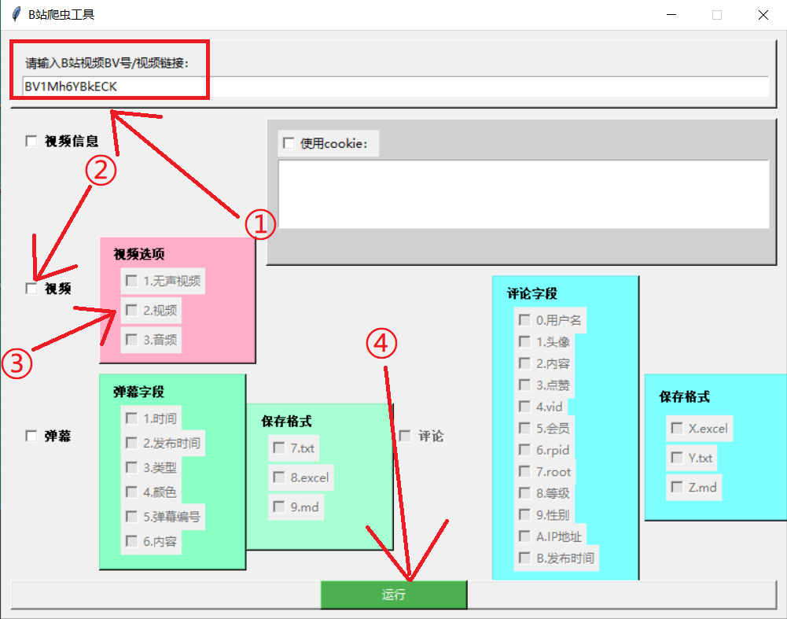
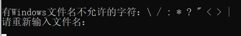
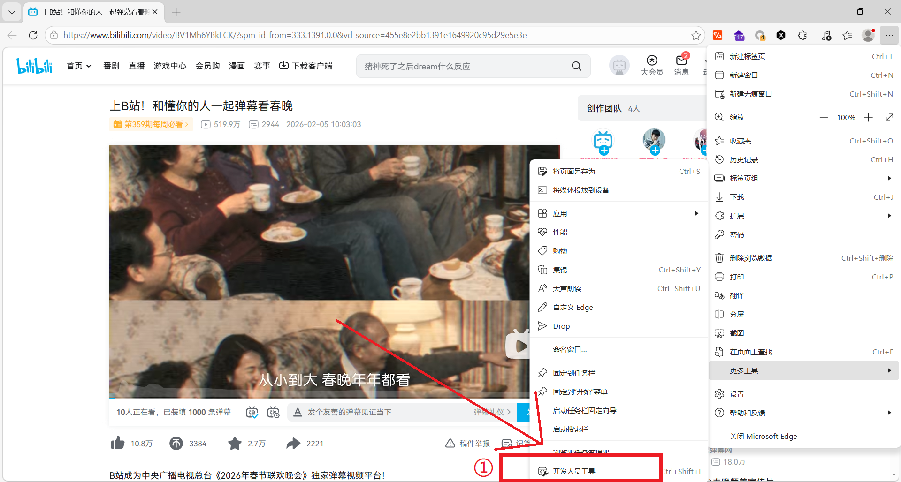
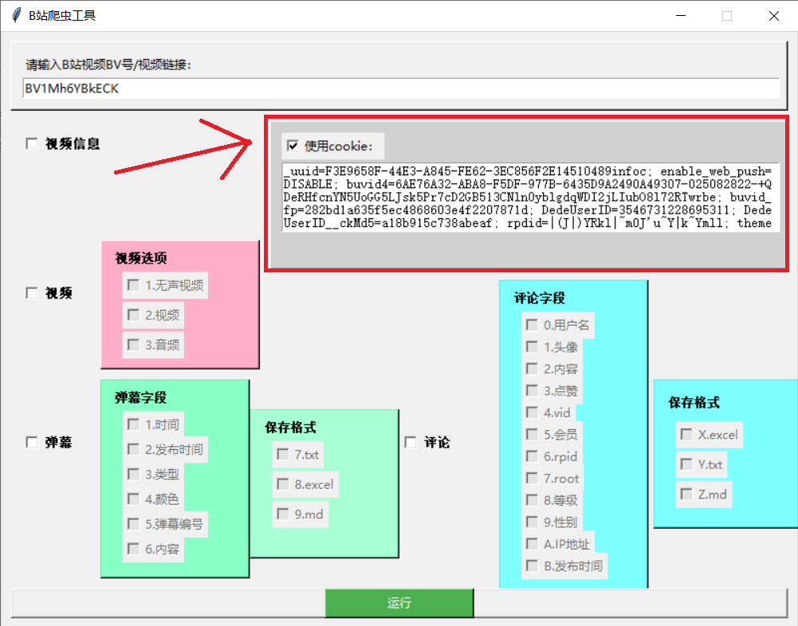
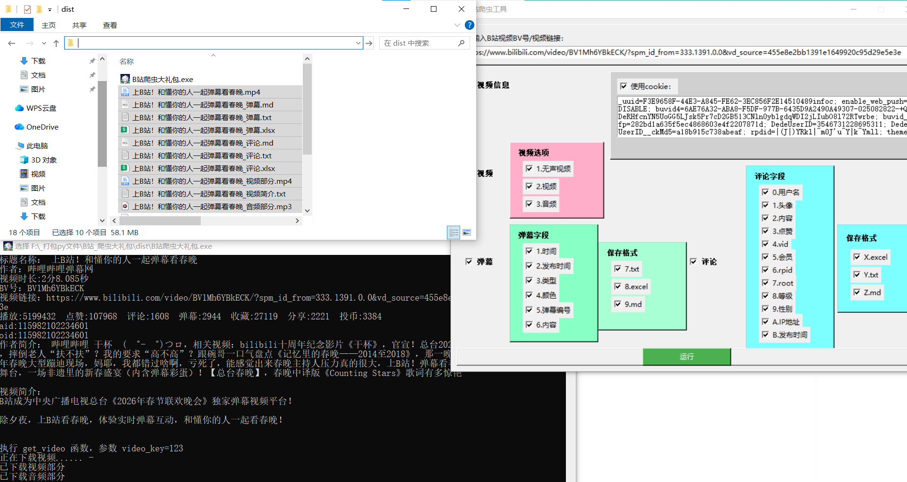
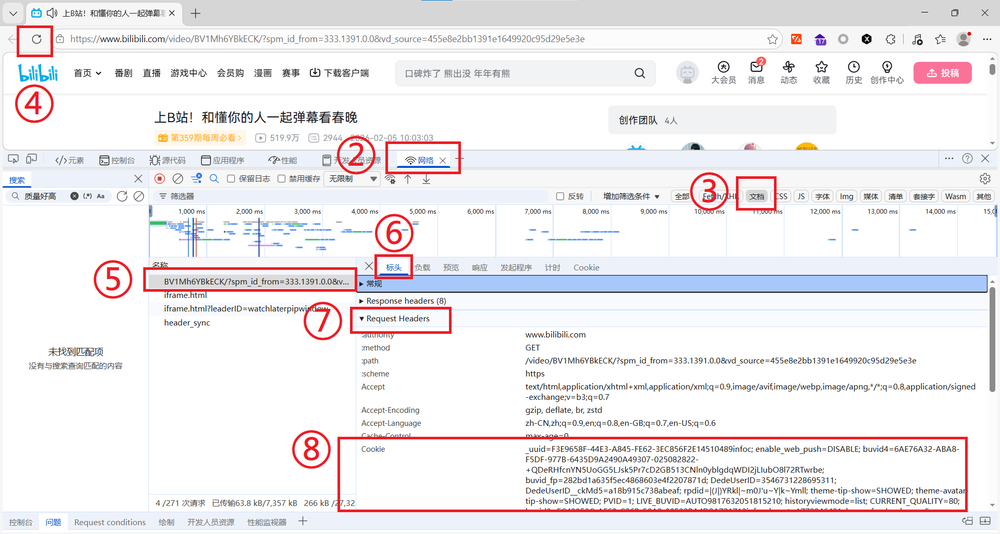

# **B站爬虫**

### **简介**：

​		你可以通过运行python程序，爬取b站视频页面中的视频信息、视频、弹幕，在使用cookie的情况下可以爬取高清视频和当前视频页的所有评论。

### 使用方法：

#### 1.页面介绍：

- 输入视频的BV号或网址
- 勾选要爬取的内容
- 点击运行
  - 程序会自动获取视频名称，但如果视频名称出现有Windows文件名不允许的字符：\\ / : * ? " < > |时，需要重新输入视频名称

 

#### 2.cookie获取方式： 

- ①在视频网页中，打开 “<u>开发者工具</u>”（在菜单中打开、按f12或ctrl+shift+i热键打开）

  

- ②点击Network（网络）

- ③选择Doc（Document、文档）

- ④刷新网页

- ⑤点击出现BV字段开头的文件

- ⑥点击Headers（标头）

- ⑦下滑找到Request Headers（请求标头）

- ⑧找到cookie右边的内容，整个复制

- ⑨在软件页面勾选cookie，并复制

- 

### 补充：

- 此python程序在使用cookie时，请保持适当频率的爬取，切勿进行商业用途~运行结果

### 运行结果：

# Bilibili spider

### **Introduction**:

By running this Python program, you can scrape video information, videos, and danmaku (bullet comments) from Bilibili video pages. With a cookie, you can also scrape high-definition videos and all comments on the current video page.

### Instructions:

#### 1. Interface Guide:

- Enter the BV number or URL of the video.
- Check the items you want to scrape.
- Click Run.
  - The program will automatically retrieve the video title. However, if the title contains characters not allowed in Windows filenames (such as \ / : * ? " < > |), you will need to rename it.

 

#### 2. How to Get Your Cookie:

- ① Open the "Developer Tools" on the video webpage (via the menu, pressing F12, or Ctrl+Shift+I).

  

- ② Click on the **Network** tab.

- ③ Select **Doc** (Document).

- ④ Refresh the page.

- ⑤ Click on the file starting with the BV field.

- ⑥ Click on the **Headers** tab.

- ⑦ Scroll down to find **Request Headers**.

- ⑧ Find the content next to "cookie" and copy the entire string.

  

- ⑨ Check the "cookie" option in the software interface and paste it.

  

### Notes:

- When using a cookie with this Python program, please maintain a reasonable scraping frequency. Do not use it for commercial purposes.

### Result：

